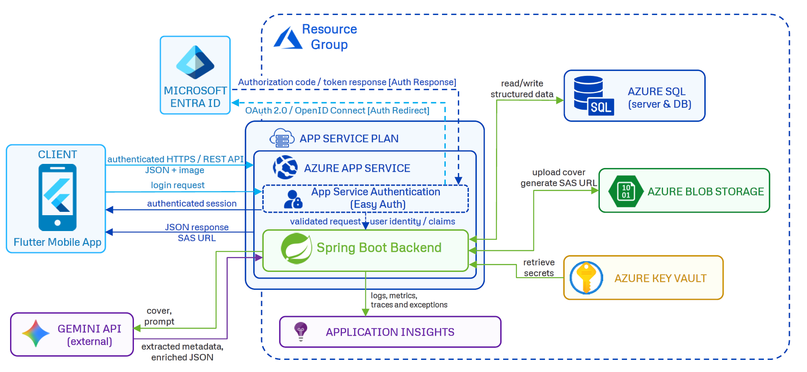

# ShelfScan AI

**ShelfScan AI** è un'applicazione cloud per catalogare una libreria personale partendo dalla scansione della copertina di un libro.

L'utente accede con account Microsoft, scatta o seleziona una foto, riceve una preview generata con AI, può correggere i dati riconosciuti e salva il libro nella propria libreria. Il sistema separa il catalogo globale dei libri dalla libreria personale di ogni utente, così lo stesso libro può essere riutilizzato senza duplicare informazioni e senza sovrascrivere le preferenze individuali.

Il progetto integra un'app mobile **Flutter**, un backend **Spring Boot** distribuito su **Azure App Service**, un database **Azure SQL**, storage immagini su **Azure Blob Storage**, gestione dei segreti con **Azure Key Vault**, autenticazione tramite **Azure App Service Authentication / Easy Auth** e monitoraggio con **Application Insights**.

---

## Indice

- [Obiettivo](#obiettivo)
- [Funzionalità principali](#funzionalità-principali)
- [Architettura](#architettura)
- [Logica applicativa](#logica-applicativa)
- [Flusso di scansione](#flusso-di-scansione)
- [Strategie di ottimizzazione](#strategie-di-ottimizzazione)
- [Servizi Azure utilizzati](#servizi-azure-utilizzati)
- [Stack tecnologico](#stack-tecnologico)
- [Struttura del progetto](#struttura-del-progetto)
- [API principali](#api-principali)
- [Configurazione](#configurazione)
- [Provisioning Azure](#provisioning-azure)
- [Sicurezza](#sicurezza)

---

## Obiettivo

ShelfScan AI nasce come progetto di cloud computing con l'obiettivo di mostrare l'integrazione tra applicazione mobile, backend cloud e servizi gestiti Azure.

Il problema affrontato è la catalogazione manuale di una libreria personale. Normalmente l'utente dovrebbe inserire titolo, autore, descrizione, immagine e tag. L'app riduce questo lavoro usando una foto della copertina per riconoscere il libro e proporre automaticamente metadati modificabili.

---

## Funzionalità principali

- Login tramite account Microsoft.
- Scansione della copertina da fotocamera o galleria.
- Preview AI con titolo, autore, descrizione, tag e confidenza.
- Possibilità di correggere i dati prima del salvataggio.
- Libreria personale separata per ogni utente.
- Stati di lettura: `TO_READ`, `READING`, `READ`.
- Salvataggio pagina corrente quando il libro è in lettura.
- Personalizzazione di titolo e tag per il singolo utente.
- Upload delle cover su Azure Blob Storage.
- Lettura sicura delle cover tramite URL SAS temporanei.
- Monitoraggio del backend tramite Application Insights.
- Provisioning Azure tramite script PowerShell.

---

## Architettura



Il frontend non comunica direttamente con database, storage o servizi AI. Tutte le operazioni passano dal backend, che gestisce autenticazione, logica applicativa, salvataggio dati, upload immagini e accesso ai segreti.

---

## Logica applicativa

ShelfScan AI è basata su due livelli di dati:

1. **catalogo globale**, cioè l'insieme dei libri conosciuti dall'app;
2. **libreria utente**, cioè l'associazione tra un utente e i libri che ha salvato.

Il catalogo globale è rappresentato dall'entità `Book`. Contiene i dati canonici del libro: titolo, titolo normalizzato, autore, URL della cover, descrizione e tag.

La libreria personale è rappresentata dall'entità `UserBook`. Contiene dati specifici dell'utente: stato di lettura, pagina corrente, titolo personalizzato, tag personalizzati e data di aggiornamento.

Questa scelta evita copie ridondanti dello stesso libro. Se più utenti scansionano lo stesso volume, il backend può riutilizzare il record globale `Book`, mantenendo però impostazioni personali diverse tramite `UserBook`.

Esempio:

```text
Book
- titolo globale
- autore
- descrizione
- cover
- tag generali

UserBook
- utente
- libro associato
- stato di lettura
- pagina corrente
- titolo personalizzato
- tag personali
```

Quando l'app mostra la libreria, il backend prende i dati del libro globale e, se presenti, applica sopra le personalizzazioni dell'utente. In questo modo l'utente può modificare titolo e tag nella propria libreria senza alterare necessariamente il catalogo globale.

---

## Flusso di scansione

La scansione è divisa in due fasi: **preview** e **confirm**.

### 1. Preview

Nella fase di preview il frontend invia al backend l'immagine della copertina tramite:

```http
POST /api/scan/preview
```

Il backend verifica prima l'utente tramite gli header generati da Easy Auth. Poi prova a riconoscere il libro e restituisce una risposta modificabile contenente titolo, autore, descrizione, tag, eventuale `matchedBookId` e livello di confidenza.

La preview non salva ancora definitivamente il libro nella libreria dell'utente. Serve per mostrare un risultato controllabile prima della conferma.

### 2. Ricerca di libri già presenti

Prima di creare un nuovo libro, il backend prova a capire se il libro è già noto. Il controllo può avvenire tramite titolo e autore, oppure tramite titolo normalizzato.

Il titolo normalizzato serve a confrontare meglio titoli simili, riducendo differenze dovute a maiuscole, simboli o piccole variazioni testuali.

Se viene trovato un libro già arricchito, il backend può riutilizzare descrizione, tag e cover senza richiedere un nuovo arricchimento AI.

### 3. Donor strategy

Una parte rilevante della logica è la strategia del **donor**.

Con donor si intende un libro già presente nel catalogo globale che può fornire descrizione e tag a una nuova scansione simile. Questo è utile quando il titolo riconosciuto è una variante, un volume, un'edizione diversa o un testo molto vicino a un libro già salvato.

A livello logico il backend:

- cerca candidati già arricchiti nel catalogo;
- confronta titolo riconosciuto e titoli esistenti;
- valuta la somiglianza tramite normalizzazione e sovrapposizione dei token;
- se trova un candidato sufficientemente compatibile, riusa descrizione e tag del donor.

Questa logica permette di evitare chiamate AI ripetute quando il sistema possiede già informazioni utilizzabili.

### 4. Gemini extract ed enrich

Quando non è possibile riusare informazioni già presenti, il backend usa Gemini in due passaggi logici:

- **extract**, per estrarre dalla copertina titolo e autore;
- **enrich**, per generare descrizione e tag a partire dal libro identificato.

L'app non tratta la risposta AI come definitiva. Il risultato viene mostrato all'utente, che può correggerlo prima del salvataggio.

### 5. Confirm

Dopo la preview, l'utente può modificare titolo e tag. Quando conferma, il frontend invia i dati a:

```http
POST /api/scan/confirm
```

In questa fase il backend salva davvero il libro. Se il libro non esiste, crea un nuovo record nel catalogo globale. Se il libro esiste già, aggiorna solo i campi mancanti, evitando di sovrascrivere dati globali già presenti in modo aggressivo.

Infine crea o aggiorna la relazione `UserBook`, cioè l'inserimento del libro nella libreria personale dell'utente.

---

## Strategie di ottimizzazione

Il progetto applica diverse strategie per ridurre elaborazioni ridondanti e contenere i costi dell'ambiente cloud.

### Preview prima del salvataggio

Il backend non salva immediatamente il risultato della scansione. Prima restituisce una preview modificabile. Questo riduce dati errati nel database e permette all'utente di correggere il risultato prima del salvataggio.

### Riutilizzo del catalogo globale

Se un libro è già presente ed è già stato arricchito, il backend può riutilizzare descrizione e tag già salvati. Questo evita nuove chiamate AI per libri già noti.

### Donor strategy

La donor strategy permette di riusare dati da libri simili già presenti, invece di generare sempre nuovi contenuti. È particolarmente utile con varianti di titolo, volumi o edizioni simili.

### Separazione tra preview e confirm

La cover viene salvata definitivamente solo in fase di conferma. In questo modo una scansione abbandonata non produce necessariamente dati persistenti o file non necessari nello storage.

### Aggiornamento conservativo del catalogo globale

Quando un libro esiste già, il backend non sovrascrive automaticamente tutti i campi globali. Aggiorna principalmente i dati mancanti. Questo riduce il rischio che una scansione meno precisa peggiori un record già valido.

### Modalità mock per test

Il backend prevede una modalità in cui Gemini può essere disabilitato. Questo consente di testare il flusso applicativo senza consumare chiamate al servizio AI.

### Dimensionamento cloud da ambiente dev

Le risorse Azure sono state configurate per un ambiente di sviluppo, con attenzione a servizi essenziali e costi contenuti. L'obiettivo non è sovradimensionare l'infrastruttura, ma usare i servizi necessari al funzionamento del progetto.

---

## Servizi Azure utilizzati

| Servizio | Ruolo nel progetto |
|---|---|
| Azure App Service | Hosting del backend Spring Boot |
| App Service Plan | Piano di esecuzione dell'App Service |
| Azure App Service Authentication | Login Microsoft ed Easy Auth |
| Azure SQL Database | Persistenza di libri e librerie utente |
| Azure SQL Server | Server logico che ospita il database |
| Azure Blob Storage | Salvataggio delle immagini di copertina |
| Azure Key Vault | Gestione centralizzata dei segreti |
| Managed Identity | Accesso dell'App Service al Key Vault |
| Application Insights | Monitoraggio, metriche e diagnostica |

---

## Stack tecnologico

### Backend

- Java
- Spring Boot
- Spring Web
- Spring Data JPA
- Azure SQL Database
- Azure Blob Storage SDK
- Azure Key Vault integration
- Gemini API
- Gradle

### Frontend

- Flutter
- Dart
- Riverpod
- GoRouter
- Dio
- Flutter Secure Storage
- Flutter InAppWebView
- Image Picker

### Cloud

- Azure App Service
- Azure SQL Database
- Azure Blob Storage
- Azure Key Vault
- Managed Identity
- Application Insights

---

## Struttura del progetto

```text
ShelfScan-AI/
├── src/
│   └── main/
│       ├── java/com/shelfscanai/
│       │   ├── controller/
│       │   ├── dto/
│       │   ├── entity/
│       │   ├── exception/
│       │   ├── repository/
│       │   └── service/
│       └── resources/
│           └── application.yml
│
├── frontend/
│   ├── lib/
│   │   ├── core/
│   │   ├── features/
│   │   ├── models/
│   │   └── main.dart
│   └── pubspec.yaml
│
├── scripts/
│   └── azure/
│       └── provisioning/
│
├── build.gradle
├── settings.gradle
└── README.md
```

---

## API principali

| Metodo | Endpoint | Descrizione |
|---|---|---|
| `GET` | `/api/me` | Restituisce informazioni sull'utente autenticato |
| `POST` | `/api/scan/preview` | Analizza una cover e restituisce una preview modificabile |
| `POST` | `/api/scan/confirm` | Conferma lo scan e salva il libro |
| `GET` | `/api/library` | Restituisce la libreria dell'utente |
| `GET` | `/api/library/{bookId}` | Restituisce il dettaglio di un libro nella libreria utente |
| `POST` | `/api/library/{bookId}` | Aggiunge un libro esistente alla libreria |
| `DELETE` | `/api/library/{bookId}` | Rimuove un libro dalla libreria utente |
| `PATCH` | `/api/library/{bookId}/status` | Aggiorna stato di lettura e pagina corrente |
| `PATCH` | `/api/library/{bookId}/metadata` | Aggiorna titolo e tag personali |
| `GET` | `/api/books` | Cerca nel catalogo globale |
| `GET` | `/api/books/{id}` | Restituisce un libro del catalogo globale |
| `PATCH` | `/api/books/{id}` | Aggiorna i dati globali di un libro |

---

## Configurazione

Il backend legge la configurazione da `application.yml`. I valori sensibili non sono salvati direttamente nel repository, ma caricati da Azure Key Vault.

Secret principali:

```text
spring-datasource-url
spring-datasource-username
spring-datasource-password
app-blob-connection-string
app-blob-container
app-gemini-api-key
```

Esempio logico di configurazione:

```yaml
spring:
  config:
    import: optional:azure-keyvault://

app:
  blob:
    connection-string: ${app-blob-connection-string}
    container: ${app-blob-container}
  gemini:
    api-key: ${app-gemini-api-key}
```

---

## Provisioning Azure

Il progetto include script PowerShell per creare e configurare l'ambiente Azure.

Gli script coprono:

- Resource Group;
- Storage Account;
- Blob container per le cover;
- Key Vault;
- SQL Server;
- SQL Database;
- App Service Plan;
- App Service;
- Managed Identity;
- Application Insights;
- permessi tra App Service e Key Vault;
- configurazione dei secret richiesti dall'applicazione.

Il provisioning è pensato per essere non distruttivo: se una risorsa esiste già, non viene ricreata.

---

## Sicurezza

Il progetto evita di salvare credenziali direttamente nel codice sorgente. Le informazioni sensibili vengono gestite tramite Azure Key Vault e lette dal backend in fase di esecuzione.

L'autenticazione è gestita tramite Azure App Service Authentication. Il backend identifica l'utente tramite gli header generati da Easy Auth, invece di ricevere direttamente credenziali dal frontend.

Le immagini delle cover vengono lette tramite URL SAS temporanei generati dal backend. Questo permette di non esporre il container Blob come archivio pubblico permanente.

---
